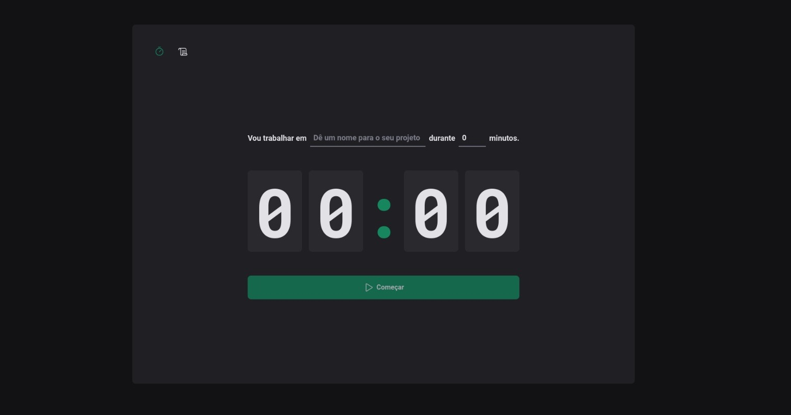
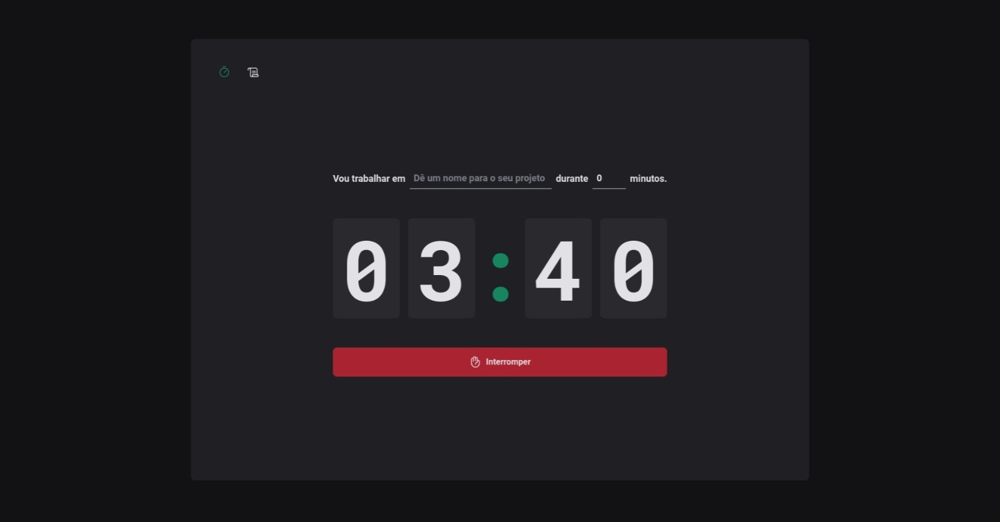
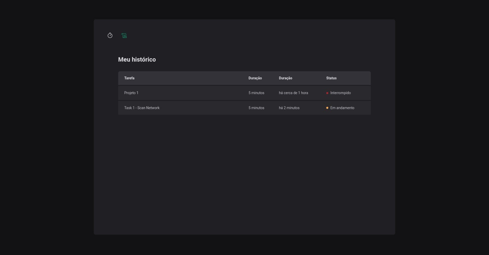

# TimeSheet

O TimeSheet é uma aplicação de gestão de tempo projetada para ajudar você a organizar suas atividades diárias. Seja para estudos, trabalho, atividades físicas ou leitura, o TimeSheet permite que você insira suas atividades, defina o tempo planejado e mantenha um histórico detalhado do tempo real gasto em cada uma.





## Funcionalidades Principais

- **Adição de Atividades:** Adicione suas atividades, especificando a natureza da tarefa e o tempo estimado para conclusão.

- **Histórico de Atividades:** Visualize um histórico completo com detalhes como o tempo real gasto e o status da atividade ("em andamento", "interrompida" ou "concluída").

- **Gestão de Tempo:** Obtenha insights sobre como você utiliza seu tempo, identificando padrões e áreas de melhoria.

## Tecnologias Utilizadas

O projeto está sendo desenvolvido utilizando as seguintes tecnologias:

- React
- Vite


## Instalação

Siga os passos abaixo para instalar e executar o projeto localmente:

1. **Clone o Repositório:**
   ```bash
   git clone https://github.com/seu-usuario/TimeSheet.git
   cd TimeSheet

2. **Instale as dependêndencias:**
    ```bash
    npm install

3. **Execute a Aplicação:**
    ```bash
    npm run dev

